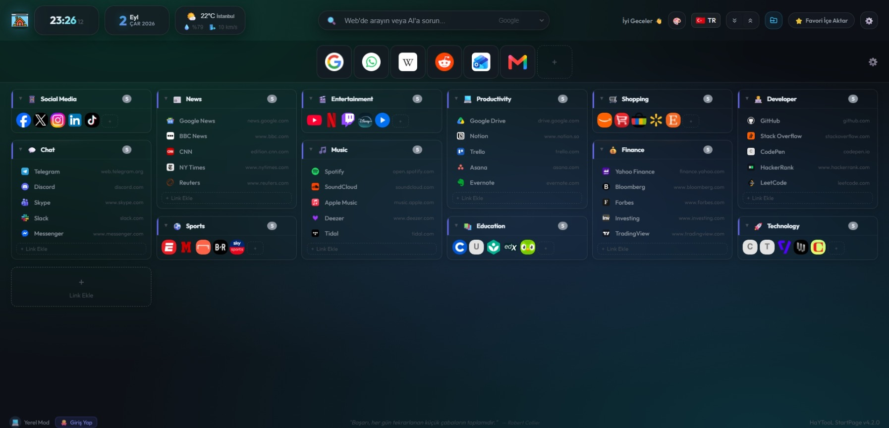

# HaYTooL Cloud StartPage — Web Portal 🌐

  
   
  <i>"Official Landing Page & OAuth Web Authentication Gateway"</i>

  
  

This repository branch (`websites`) hosts the official landing page, live documentation, and secure GitHub OAuth authentication gateway for the **HaYTooL Cloud StartPage** Chromium extension.

  

---

## 🚀 Live Website & Portal

👉 **[https://haytokoraz.github.io/HaYTooL-Cloud-StartPage/](https://haytokoraz.github.io/HaYTooL-Cloud-StartPage/)**

---

## 📁 Branch Architecture & Files

- **`index.html`**: The official, 7-language multilingual (TR, EN, DE, ES, FR, RU, PT) glassmorphism landing page with store links and feature showcase.
- **`auth.html`**: The secure Firebase & GitHub OAuth bridge that safely authenticates users and communicates with the Chrome extension.
- **`privacy.html`**: Privacy Policy detailing our strict zero-tracking, privacy-first standards.
- **`terms.html`**: Terms of Service and usage conditions.
- **`assets/`**: High-resolution icons and branding assets.

---

## 🛠️ Main Project Repository

The source code of the Chrome/Edge extension is maintained on the **`master`** branch:
👉 **[https://github.com/HaYToKoRaZ/HaYTooL-Cloud-StartPage](https://github.com/HaYToKoRaZ/HaYTooL-Cloud-StartPage)**

---

## 🔗 Connect with the Developer

- 🌐 **Portfolio**: [https://haytokoraz.github.io/](https://haytokoraz.github.io/)
- 🐙 **GitHub**: [@HaYToKoRaZ](https://github.com/HaYToKoRaZ)
- 🐦 **X (Twitter)**: [@HaYTo](https://x.com/HaYTo)
- 📸 **Instagram**: [@haytokoraz](https://www.instagram.com/haytokoraz/)

---
*© 2026 HaYTooL Cloud StartPage // Crafted by HaYTo*
