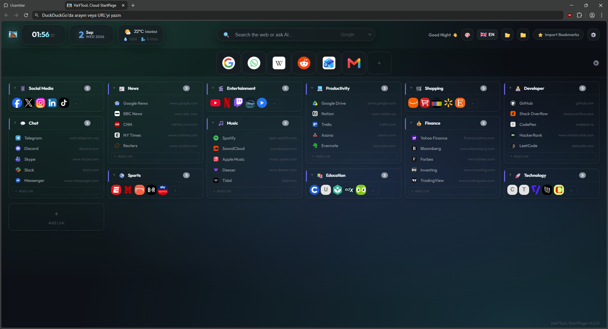

# 🚀 HaYTooL Cloud StartPage

<div align="center">

<p align="center">
  
</p>

**Modern, ultra-fast, aesthetic, modular, and privacy-focused Browser StartPage & New Tab Extension.**

[](https://github.com/HaYToKoRaZ/HaYTooL-Cloud-StartPage)
[](https://github.com/HaYToKoRaZ/HaYTooL-Cloud-StartPage)
[](https://developer.chrome.com/docs/extensions/mv3/intro/)
[](https://developer.mozilla.org/en-US/docs/Web/JavaScript)
[](https://github.com/HaYToKoRaZ/HaYTooL-Cloud-StartPage)
[](https://developer.chrome.com/docs/extensions/reference/storage/)
[](https://github.com/HaYToKoRaZ/HaYTooL-Cloud-StartPage/releases)
[](https://github.com/HaYToKoRaZ/HaYTooL-Cloud-StartPage/releases)
[](LICENSE)

<br/>

[🇬🇧 English](#-english) • [🇹🇷 Türkçe](#-türkçe)

</div>

---

<a name="-english"></a>
## 🇬🇧 English

### 🌟 Overview
**HaYTooL Cloud StartPage** is a lightning-fast, ultra-lightweight, and fully customizable browser start page and new tab extension built with **Manifest V3**. Designed with clean glassmorphism aesthetics, modular widgets, live weather forecasts, smart search integration, and robust bookmarks & speed dial management.

### 📸 Screenshot Preview
<div align="center">
  
</div>

---

### ✨ Key Features

- ⚡ **Zero-Latency Instant Launch:** Built entirely in lightweight Vanilla JavaScript and CSS; starts in **< 50ms**.
- 🎨 **Rich Aesthetics & Dynamic Themes:** Glassmorphism UI with Dark, Light, YouTube, Discord, and Matrix presets, plus custom wallpaper URL support.
- 📂 **Smart Folders & Bookmarks (Speed Dial):**
  - Group links into colorful folders with custom column layouts (1-10 columns) and adjustable icon sizes (32px - 128px).
  - Quick view modes: Icon View, Full List View, and Shortlist (10 Links).
  - One-click Netscape HTML bookmark import/export and full JSON backup/restore.
  - Multi-source Favicon & High-Res Icon fetching (Icon Horse, Google HD, DuckDuckGo).
  - Strict security confirmation for deleting links & categories.
- 🔍 **Universal Smart Search Bar:** Instant switching across popular search engines (Google, DuckDuckGo, Bing, YouTube, GitHub, Yandex, Brave) and AI assistants.
- 🌤️ **Live Weather Widget:** Accurate real-time weather and temperature updates with GPS auto-detection and global city search powered by Open-Meteo.
- 🕒 **Digital Clock, Date & Greetings:** Configurable 12/24h time, seconds display, customized timezone support, and dynamic time-of-day greetings.
- 🔒 **100% Privacy & Offline-First:** Zero analytics, zero tracking, and no external server storage. All configuration is kept secure locally inside `chrome.storage.local`.
- 🌍 **Internationalization (i18n):** Native multilingual interface switching (English & Turkish) on the fly without page reload.

---

### 🌐 Supported Browsers & Icons

<div align="center">

| <br/>**Helium** | <br/>**Chrome** | <br/>**Brave** | <br/>**Edge** | <br/>**Opera** | <br/>**Vivaldi** |
| :---: | :---: | :---: | :---: | :---: | :---: |
| `helium://extensions` | `chrome://extensions` | `brave://extensions` | `edge://extensions` | `opera://extensions` | `vivaldi://extensions` |

</div>

---

### 🚀 Installation & Usage Guide

1. **Download / Clone** the repository:
   ```bash
   git clone https://github.com/HaYToKoRaZ/HaYTooL-Cloud-StartPage.git
   ```
   *Alternatively, download the `.zip` from the [Latest Release](https://github.com/HaYToKoRaZ/HaYTooL-Cloud-StartPage/releases) and extract it.*

2. Open your Chromium-based browser and navigate to the Extensions management page:
   -  **Helium Browser:** `helium://extensions/` or `chrome://extensions/`
   -  **Google Chrome:** `chrome://extensions/`
   -  **Brave Browser:** `brave://extensions/`
   -  **Microsoft Edge:** `edge://extensions/`
   -  **Opera / Opera GX:** `opera://extensions/`
   -  **Vivaldi:** `vivaldi://extensions/`

3. Turn ON the **Developer mode** toggle in the top-right corner.
4. Click **Load unpacked** (*Paketlenmemiş öge yükle*).
5. Select the `HaYTooL Cloud StartPage` folder.
6. Open a new tab and enjoy your new homepage! 🎉

---

### 🛠️ Tech Stack & Architecture

| Component | Technology | Description |
| :--- | :--- | :--- |
| **Platform** | Manifest V3 (MV3) | Chromium Web Extension Standard |
| **Logic** | Vanilla JavaScript (ESNext) | Modular, zero-framework, dependency-free architecture |
| **Styling** | Vanilla CSS3 | Custom properties, glassmorphism, responsive grid layout |
| **Storage** | `chrome.storage.local` | Asynchronous, fast, and local data persistence |
| **Weather API** | Open-Meteo & OpenStreetMap | Free, keyless, and privacy-respecting weather forecast |
| **Icons** | Icon Horse / Google API | Multi-provider high-resolution favicon resolution |

---

<br/>

---

<a name="-türkçe"></a>
## 🇹🇷 Türkçe

### 🌟 Genel Bakış
**HaYTooL Cloud StartPage**, modern **Manifest V3** mimarisiyle geliştirilmiş; ultra hızlı, hafif, tamamen kişiselleştirilebilir ve gizlilik odaklı bir yeni sekme (New Tab / StartPage) tarayıcı eklentisidir. Buzlu cam (glassmorphism) efektleri, canlı hava durumu göstergesi, zengin arama motorları, gelişmiş klasör ve favori yönetimi ile tarayıcınıza şık bir başlangıç sayfası deneyimi sunar.

### 📸 Ekran Görüntüsü Önizlemesi
<div align="center">
  
</div>

---

### ✨ Öne Çıkan Özellikler

- ⚡ **Ultra Hızlı Açılış:** Ağır kütüphaneler (React/Vue vb.) olmadan, saf Vanilla JS ve CSS ile **< 50ms** açılış hızı.
- 🎨 **Gelişmiş Görsellik & Temalar:** Koyu (Dark), Açık (Light), YouTube, Discord ve Matrix temaları; dilediğiniz özel görsel URL'si ile arka plan ayarlama desteği.
- 📂 **Kategorize Edilebilir Hızlı Erişim (Speed Dial):**
  - Renkli klasörler, 1'den 10'a kadar ayarlanabilir sütun düzeni ve 32px - 128px arası ikon boyutları.
  - İkon Görünümü, Tam Liste Görünümü ve Kısa Liste (10 Link) seçenekleri.
  - Standart Netscape HTML yer imi içe/dışa aktarma ve JSON yedekleme desteği.
  - Otomatik ve yüksek çözünürlüklü favicon motoru (Icon Horse, Google HD vb.).
  - Yanlışlıkla silinmeyi engelleyen güvenli onaylı ("SİL" kelimesi doğrulamalı) temizleme sistemi.
- 🔍 **Gelişmiş Arama Çubuğu:** Google, DuckDuckGo, Bing, YouTube, GitHub, Yandex, Brave ve Yapay Zeka servisleri arasında anında tek tıkla geçiş.
- 🌤️ **Canlı Hava Durumu:** GPS otomatik konum algılama veya global şehir arama destekli, Open-Meteo destekli hava durumu göstergesi.
- 🕒 **Saat, Tarih ve Karşılama:** 12/24 saat formatı, saniye göstergesi, özel zaman dilimi (timezone) seçimi ve günün saatine göre akıllı selamlama.
- 🔒 **%100 Gizlilik & Çevrimdışı Çalışma:** Telemetri yok, takip kodu yok, harici sunucuya veri gönderme yok. Tüm ayarlarınız `chrome.storage.local` üzerinde yerel kalır.
- 🌍 **Anında Dil Değiştirme (i18n):** Sayfayı yenilemeye gerek kalmadan Türkçe ve İngilizce arasında dinamik geçiş.

---

### 🌐 Desteklenen Tarayıcılar ve Simgeleri

<div align="center">

| <br/>**Helium** | <br/>**Chrome** | <br/>**Brave** | <br/>**Edge** | <br/>**Opera** | <br/>**Vivaldi** |
| :---: | :---: | :---: | :---: | :---: | :---: |
| `helium://extensions` | `chrome://extensions` | `brave://extensions` | `edge://extensions` | `opera://extensions` | `vivaldi://extensions` |

</div>

---

### 🚀 Kurulum ve Geliştirici Modunda Çalıştırma

1. Projeyi bilgisayarınıza indirin veya klonlayın:
   ```bash
   git clone https://github.com/HaYToKoRaZ/HaYTooL-Cloud-StartPage.git
   ```
   *Veya [Son Sürüm (Releases)](https://github.com/HaYToKoRaZ/HaYTooL-Cloud-StartPage/releases) sayfasından `.zip` indirip bir klasöre çıkartın.*

2. Kullandığınız Chromium tabanlı tarayıcının Eklentiler sayfasına gidin:
   -  **Helium Browser:** `helium://extensions/` veya `chrome://extensions/`
   -  **Google Chrome:** `chrome://extensions/`
   -  **Brave Browser:** `brave://extensions/`
   -  **Microsoft Edge:** `edge://extensions/`
   -  **Opera / Opera GX:** `opera://extensions/`
   -  **Vivaldi:** `vivaldi://extensions/`

3. Sağ üst köşedeki **Geliştirici Modu**'nu (Developer mode) açık konuma getirin.
4. Sol üstteki **Paketlenmemiş öge yükle** (Load unpacked) butonuna tıklayın.
5. `HaYTooL Cloud StartPage` klasörünü seçin.
6. Yeni bir sekme açarak başlangıç sayfanızın keyfini çıkarın! 🎉

---

### 🛠️ Teknoloji Yığını ve Mimari

| Bileşen | Teknoloji | Açıklama |
| :--- | :--- | :--- |
| **Platform** | Manifest V3 (MV3) | Modern Chromium Eklenti Standardı |
| **Mantık (Logic)** | Vanilla JavaScript (ESNext) | Bağımsızlıksız, modüler ve yüksek performanslı kod yapısı |
| **Tasarım & Stil** | Vanilla CSS3 | Glassmorphism, CSS değişkenleri, responsive grid yapısı |
| **Depolama** | `chrome.storage.local` | Hızlı, güvenilir ve yerel veri saklama katmanı |
| **Hava Durumu API** | Open-Meteo & OpenStreetMap | Ücretsiz, gizlilik dostu ve anahtarsız API |
| **İkon Motoru** | Icon Horse / Google Favicon API | Yüksek kaliteli favicon çözücü |

---

## 📄 Lisans
Bu proje [MIT](LICENSE) lisansı altında korunmaktadır. Özgürce kullanabilir, çatallayabilir (fork) ve katkıda bulunabilirsiniz.